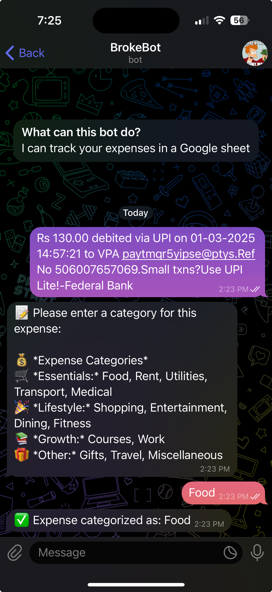

# Broke Bot

**Broke Bot** is a lightweight Telegram bot designed to track daily expenses and log them into Google Sheets. Built on **Google Apps Script**, it provides an easy-to-use interface for managing finances directly from Telegram.

## ✨ Features

- **Expense Tracking**: Log expenses from Telegram messages into Google Sheets.
- **Google Sheets Integration**: Automatically stores and categorizes expenses.
- **Telegram Bot Interface**: Interact with the bot to categorize and manage spending.
- **Automated Deployment**: Uses GitHub Actions to deploy code to Google Apps Script.

## 🚀 Benefits

- Easily create **pivot tables, charts, and graphs** in Google Sheets to analyze spending habits.
- Stores data in a **simple format** for effortless analysis.
- **No app installation required**—just chat with the bot.
- **Automated reminders** ensure you never forget to log expenses. Simply forward your transaction SMS messages.

## 📝 Notes on Google Apps Script

- **Webhook Responses**: Google Apps Script returns `302 Found` if a response body is included, which can break Telegram webhooks. **Avoid returning unnecessary content**.
- **Authentication**: Google Apps Script does **not** support GCP service accounts for authentication.  
  - Use a **user token** instead, refresh it manually, and update GitHub Secrets for CI/CD.
- **CLI (`clasp`)**:  
  - `clasp login` stores authentication in `~/.clasprc.json`.  
  - **Heads-up**: `clasp run` expects `.clasprc.json` inside the project directory—copy it manually.
- **Deployments**:  
  - **HEAD deployments**: Latest pushed code, can be used for testing.
  - **Versioned deployments**: Used for production stability.  
  - **Deployment Limit**: Only **20 versions** can exist at a time—remove older ones regularly (automated via GitHub Actions).

---

Built to **simplify personal finance tracking**. After evaluating existing solutions that were too complex, restrictive, or overloaded with features, I created **Broke Bot**—a **lightweight, user-friendly, and free** tool for effortless expense management.

## ⚙️ Some Setup Steps

### Telegram Bot Creation
Create a Telegram bot with BotFather before connecting your bot to Telegram. Refer to the [Microsoft Bot Framework docs](https://learn.microsoft.com/en-us/azure/bot-service/bot-service-channel-connect-telegram?view=azure-bot-service-4.0#create-a-new-telegram-bot-with-botfather) for detailed instructions.
- Start a new conversation with the BotFather.
- Visit @BotFather
- Send `/newbot` to create a new Telegram bot.
- Give the Telegram bot a unique username. Note that the bot name must end with the word "bot" (case-insensitive).
- Copy and save the Telegram bot's access token for later steps.

### Telegram Webhook configuration
```bash
curl 'https://api.telegram.org/bot$BOT_TOKEN$/setWebhook?url=$GOOGLE_APP_SCRIPT_DEPLOYMENT_URL'
```

### Google Sheets
- Create a new Google Sheets document. Sheet ID will be in the URL.

### Google Apps Script
- Create a new Google Apps Script project as a Web App.
- Set few Script properties for the project. `TELEGRAM_BOT_TOKEN`,`SHEET_ID`,`TELEGRAM_USER_ID`,`CHAT_ID`.

Things will definitely be missing, if anyone wants to set this up, please let me know. I will be happy to help.

